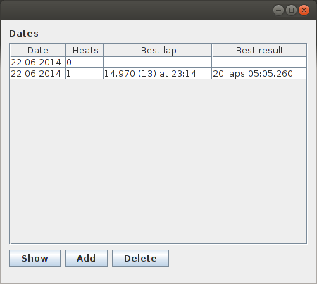
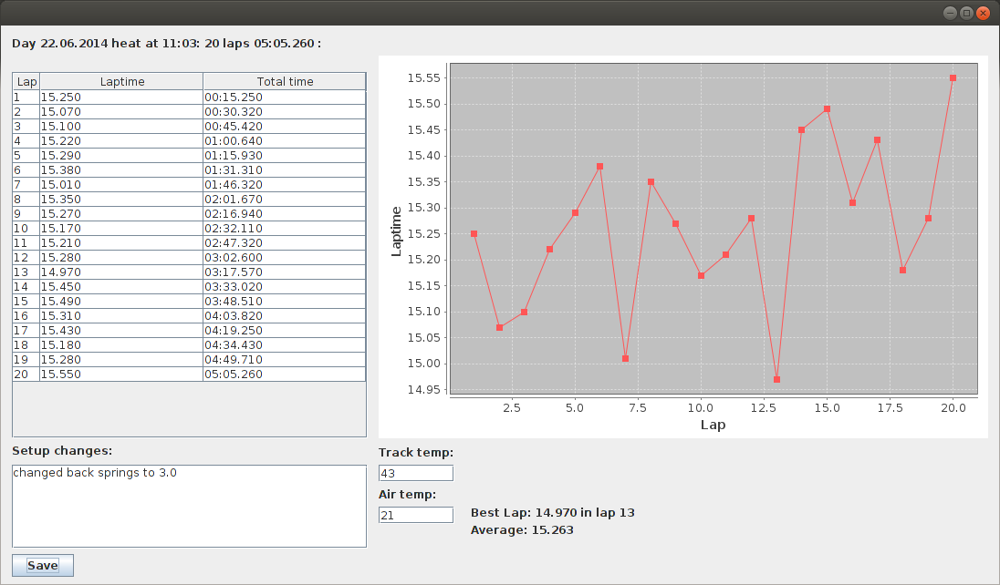

#Käyttöohje

Ohjelman saa käynnistettyä suorittamalla repositorion päähakemistossa 'java -jar LapReader.jar'.

##Dates-näkymä

Pääikkunana toimii päivien listanäkymä, josta näkee tietokannassa olevat päivät. 

Päivänäkymään saa lisättyä uuden päivän painamalla Add-nappia. Date sarakkeeseen voi syöttää päivämäärän muodossa dd.MM.yyyy tai sen voi jättää tyhjäksi, mikäli haluaa käyttää nykyistä päivämäärää. Päivän lisääminen viimeistellään painamalla enter-näppäintä tai klikkaamalla taulukossa muualle. Päivän lisääminen avaa päivän omassa ikkunassaan.

Päivämäärän muokkaus onnistuu yksinkertaisesti klikkaamalla muokattaavaa päivämäärää ja muokkaamalla tekstiä.

Päivän avaaminen onnistuu valitsemalla päivä ja käyttämällä Show-painiketta.

Päivän poistaminen taas tapahtuu valitsemalla päivä jä käyttämällä Delete-painiketta.

##Heats-näkymä
Heat näkymä toimii täysin vastaavasti kuin Date-näkymä, ainoana erona päivämäärän vaihtuminen kellonaikaan, jonka täytyy olla muodossa HH:mm.

#Heat-näkymä

Heat näkymässä näytetään kyseisen heatin kierrosajat. Näkymässä olevaa kuvajaa saa suurennettua valitsemalla hiirellä haluttu alue. Pienentäminen alkuperäiseen onnistuu valikosta, jonka saa auki klikkaamalla kuvaajaa hiiren kakkosnäppäimellä.

Näkymässä voidaan tallentaa heattiin liittyvät tiedot, kuten säätömuutokset ja lämpötilat niitä vastaaviin kenttiin. Tiedot tallentuvat save-painikkeella.
