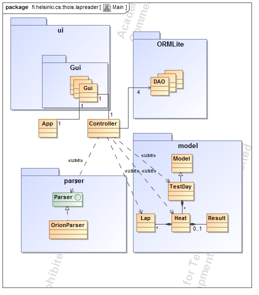
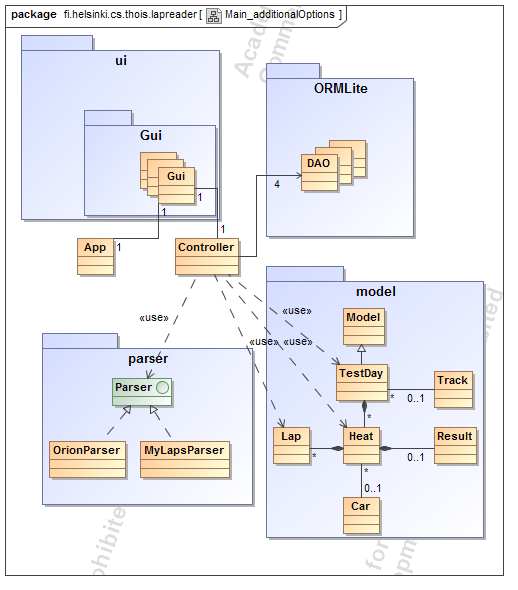

#Rakennekuvaus

Ohjelma on toteutettu käyttäen ORMLite-persistointikirjastoa, joka asetti rajapuitteet toteutustavalle.

##Controller
Ohjelman perustan muodostaa Controller-luokka, joka pitää sisällään lähes kaiken ohjelman toimnallisuuden. Controller pitää huolta myös tietokantayhteyksistä ja olioiden persistoinnista ORMLiten data access olioiden (DAO) avulla. Jokaisella mallilla on oma daonsa, joka huolehtii kyseisten mallien persistoinnista. Tietokantayhteyksiä on siis auki useita samaan aikaan. Controller hoitaa myös tiedostojen lukemisen.

##Mallit
Varsinaista tietosisältöä edustavat luokat on sijoitettu model-pakkaukseen. Model-luokkaan oli ajatus sijoittaa kaikkia malleja koskevaa toiminnallisuutta, jonka toteutus jäi tekemättä ajan puutteen vuoksi. Ohjelman rakenteessa haluttiin kuitenkin säilyttää helppo laajennettavuus, jonka takia Model jätettiin yläluokaksi kaikille malleille. Nykyisessä toteutuksessa se voisi aivan hyvin olla pelkkä rajapinta. Modelin perintä on jätetty selvyyden vuoksi pois luokkakaaviosta.

Varsinaisen datan ylimmän luokan muodostaa TestDay. Se kuvaa yhtä harjoituspäivää, pelkkä Day olisi kuvaavampi nimi, mutta se oli jo varattu Javassa vakiokirjastojen Date-luokalle. TestDay koostuu useista erillisistä ajokerroista eli Heat-olioista. Ajokertaan liittyy kiinteästi kierrosajat, jotka esitetään Lap-luokkaa edustavilla olioilla. Yhdellä Heatilla on siis useita Lap-olioita. Ajokertaan liittyy myös siinä saavutettu tulos, joka käsitellään Result-luokan avulla.

ORMLiteä käytettäessä yksi taulu muodostaa yhden luokan. Tämä asetti hiukan rajoitteita varsinaisen datan mallintamiseen olioiksi. Ilman rajoitteita esimerkiksi ajasta olisi voinut tehdä oman olionsa.

##Parser

Kierrosaikadataa tuodessa ohjelmaan se täytyy parsia helposti käsiteltävään muotoon, sillä yleensä automaattisten ajanottojärjestelmien data on eksoottisessa valmistajakohtaisessa muodossa. Datan parsimista varten tehdyt luokat on sijoitettu pakkaukseen parser. Parser-rajapinta muodostaa yhtenäisen rajapinnan parserin toimintaa varten, jotta parseri voidaan valita tuotavan datan mukaan. Rajapinnan toteuttaa tällä hetkellä ainoastaan OrionParser-luokka, jonka tehtävänä on parsia Team Orionin valmistaman PRO LCS -laitteen sarjaportista tallennettu kierrosaikadata puhtaiksi numeroiksi.
Kun parser-muodostaa hyvin yksinkertaisen rajapinnan, niin uusien parsereiden toteuttaminen on todella yksinkertaista.

##Käyttöliittymä

Käyttöliittymän rungon muodostaa abstrakti ListView-luokka, joka josta muut listanäkymät. DayListView listaa päivät ja vastaavasti HeatListView listaa heatit. Molemmat ikkunat tarjoavat mahdollisuudet mallien hallintaan. Listanäkymä tarvitsi myös tapahtumankuuntelijan, jonka tehtävää hoitaa ListViewActionListener.

Listanäkymä toimii käyttämällä jTable -taulukkoa. Myöhempää taulukon toiminnallisuutta varten tarvitsi jokatapauksessa taulukkomallit malleja varten, joita tarjoaa pakkaus gui.tableModel. Kyseinen pakkaus sisältää taulukossa esitettäviä tietotyyppejä varten TableModel rajapinnan toteuttavat taulukkomallit, jotka periytyvät DefaultTableModel-luokasta. Tällä hetkellä taulukkomallit määrittävät ainoastaan muokattavissa olevat sarakkeet. Lisäksi pakkaus sisältää tapahtumankuuntelijan taulukoita varten.

HeatView tarjoaa näkymän heatin tarkempien tietojen tutkimista varten. Tämän periyttäminen ListViewistä osoittautui hankalaksi, joten se piirrettiin GuiBuilderilla uudestaan.

Käyttöliittymän luonnin ja käynnistämisen hoitaa Gui-luokka, joka on ajettava. Tämä mahdollistaa käyttöliittymän siirtämisen omaan threadiin tulevaisuudessa, joka tarvitaan taustatiedonsiirtoa varten. Kyseinen ominaisuus on siis tarkoitus toteuttaa myöhemmin.

##Suunnitellut tulevat laajennukset

Yllä on esitetty vielä luokkakaavio suunniteltujen laajennuksen kanssa. Testipäivä suoritetaan tietyllä radalla, jota esittä Track-luokka. Lisäksi Heattiin yhdistetään tieto autosta Car-luokan olioiden avulla. Parser pakkaukseen on lisäksi lisätty MyLapsParser mylaps-nettisivuston käyttämää formaattia varten
